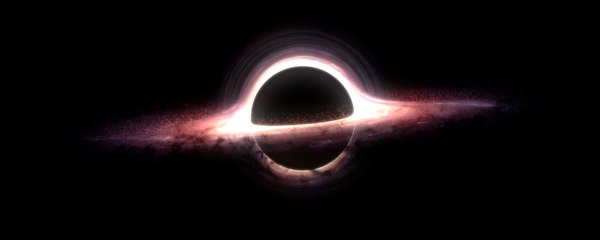
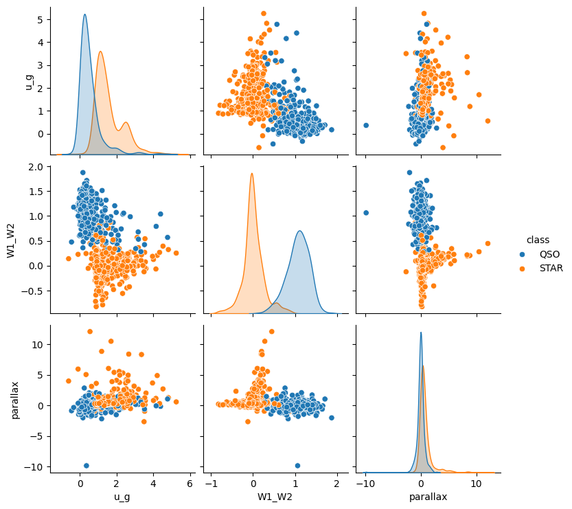

  

# 🌌 Black Hole Explorer - Quasar Classification

> **Projet de Data Science** : Identification de trous noirs supermassifs (Quasars) par fusion de données multi-spectrales.

---

## 🎯 Objectif du projet
Extraire, transformer et fusionner les données de trois sondes spatiales majeures pour entraîner un modèle de **Machine Learning** capable de distinguer les **Quasars** (QSOs) des **Étoiles**.

### Ce qu'il faut savoir
Les quasars sont des **trous noirs supermassifs**, souvent au centre d'une galaxie, qui accrètent **du gaz et de la poussière** chauffées à très haute température qui émettent de la lumière très énergétique et brillante. C'est cette lumière qui nous permet de les observer.

Hormis le trou noir supermassif de notre propre galaxie, les trous noirs stellaires (plus communs, de petite taille) nous sont invisibles. On devine leur présence par le comportement gravitationnel des étoiles qui orbitent autour d'eux.
C'est pour cette raison que ce projet se porte uniquement sur les quasars.

### 🔭 Pourquoi c'est un défi ?
Les quasars sont situés à des milliards d'années-lumière mais leur **magnitude** (luminosité apparente) ressemble à celle des étoiles de notre propre galaxie. Pour les différencier, nous utilisons une signature unique :
* 🔵 **Excès de bleu** (Spectre UV/Bleu prononcé)
* 🌡️ **Signature thermique** (Hauts infrarouges dus à la poussière chauffée)
* 📍 **Immobilité spatiale** (Parallaxe et mouvement propre quasi nuls)

---

## 🛰️ Sources de Données (The Multi-Wavelength Stack)

| Catalogue | Domaine | Utilité |
| :--- | :--- | :--- |
| **SDSS** | 🌈 Optique | Analyse du spectre visible (U, G, R, I, Z) |
| **WISE** | ☁️ Infrarouge | Détection de la poussière chaude entourant le trou noir |
| **Gaia** | 📏 Astrométrie | Mesure de la distance (parallaxe) et du mouvement |

---

## 🛠️ Étapes Clés de la Pipeline

1. **Extraction SQL** : Requêtes sur le [SkyServer SDSS](http://skyserver.sdss.org) pour un dataset équilibré.
2. **Cross-Matching** : Jointures complexes avec WISE et Gaia via les coordonnées célestes (`RA`/`DEC`).
3. **Feature Engineering** : Création des KPIs (`u-g`, `W1-W2`, `parallax`).
4. **Machine Learning** : Entraînement d'un **Random Forest** avec pondération de classe.

---

## 📊 Aperçu de l'Analyse Exploratoire (EDA)

Le graphique ci-dessous illustre la séparation nette entre les deux classes grâce à nos KPIs :

  

### 💡 Interprétation des axes :
* **`W1-W2`** : Plus la valeur est élevée, plus l'objet est "chaud" (Infrarouge). 
  * *Tendance Quasars : Valeurs élevées.*
* **`u-g`** : Plus la valeur est faible, plus l'objet est "bleu". 
  * *Tendance Quasars : Valeurs faibles.*
* **`Parallax`** : Une valeur proche de 0 indique un objet extragalactique.
  * *Tendance Quasars : Distribution centrée sur 0.*

👉 [**Consulter le Notebook détaillé**](notebooks/eda2.ipynb)

👤 **Florent Folliard** - _Étudiant Data Science (Paris Ynov Campus)_ - Avril 2026